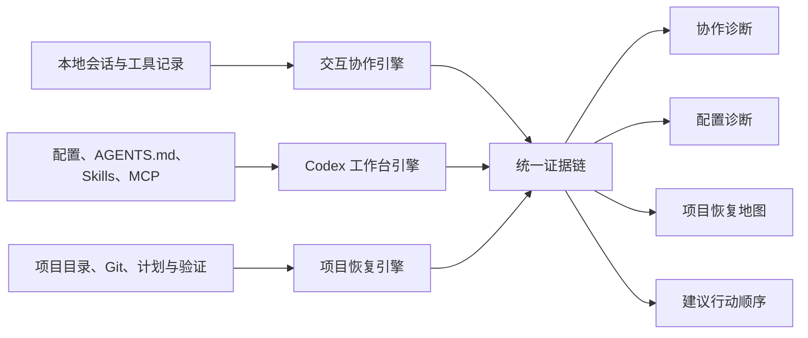

# Codex Checkup

> **让 Codex 审计 Codex：帮助你升级与 Codex 的协作方式，找出互相打架的规则和做到一半被遗忘的项目，并告诉你接下来最应该先做什么。**


`codex-checkup` 是一个本地优先、默认只读的个人 Codex 工作台审计 Skill。

它不是配置清理器，也不只是统计聊天次数。它把指定范围内的历史协作、Codex 配置、`AGENTS.md`、Skills、MCP 和项目现场串成证据链，回答四个真正影响工作的题目：

1. 我和 Codex 哪里配合得不好？
2. 我的配置、规则和 Skills 哪里冲突或失效？
3. 我现在有哪些项目，它们分别做到哪里？
4. 下一步应该先做什么，为什么？

[它解决什么](#它解决什么) · [你会得到什么](#一次体检会得到什么) · [怎样工作](#一个入口三个引擎) · [快速开始](#快速开始) · [当前进度](#当前实现进度)

## 它解决什么

很多 Codex 问题并不是模型不够强，而是工作方式失去反馈：同一种错误反复纠正、规则散落在不同文件、Skill 装了却没有触发、项目写到一半没有验证，最后谁也说不清下一步从哪里继续。

| 你遇到的情况 | 体检后应该得到什么 |
| --- | --- |
| 经常需要说“继续”“不是这样”“只改这里” | 协作弯路、主要归因和新的协作协议 |
| Codex 写完代码，却没有测试、构建或交付 | 缺失的完成闭环和可执行验证动作 |
| Skills 装了很多，不知道哪些真正发挥作用 | 确认使用、可能漏用、范围内未观察和无法判断 |
| 用户级与项目级 `AGENTS.md` 越写越乱 | 指令关系、重复、作用域错位和明确冲突 |
| 多个项目同时推进，忘了各自做到哪里 | 项目恢复地图、未完成事项和阻塞点 |
| 每个项目都能继续，但不知道先做哪个 | 有理由、有依赖、有完成条件的行动顺序 |

“没有发现 Skill 被使用”不会被写成“这个 Skill 没用”。正确的结论应该是：

> 过去 90 天的 120 次任务中，没有发现该 Skill 被触发的记录；其中 8 次任务可能符合它的触发范围，需要进一步检查描述或调用流程。

## 一次体检会得到什么

### 1. 协作诊断

比较顺利完成与发生摩擦的对话，找出值得保留的成功模式，以及返工、范围扩大、过早停止、缺少验证、降级交付和任务切换等弯路。

| 问题 | 历史证据 | 影响 | 优化动作 |
| --- | --- | --- | --- |
| 反复补充验收标准 | 多个相关任务 | 增加返工轮次 | 开始前定义可验证完成条件 |
| 完成后没有验证 | 工具与交付记录 | 结果不稳定 | 固定增加完成前验证 |
| 适用 Skill 可能漏触发 | 任务与 Skill 描述 | 重复手工处理 | 调整触发描述并做真实任务测试 |

### 2. 配置诊断

检查配置、`AGENTS.md`、Skills 与 MCP 的作用关系，区分明确冲突、重复、作用域错位、潜在张力和疑似过期。

```text
用户级 AGENTS.md
├── 全局交流与工作原则
├── 与项目规则重复
└── 与项目规则存在潜在张力

项目级 AGENTS.md
├── 构建与测试命令
├── 完成和验收标准
└── 已经失效的目录说明

已安装 Skills
├── 确认使用
├── 可能漏用
├── 范围内未观察
└── 触发描述重叠
```

### 3. 项目恢复地图

从历史会话中的工作目录、Codex 最近项目记录和用户指定目录发现项目，再结合 Git、文件、计划、测试和交付证据恢复状态。

| 项目 | 当前状态 | 已完成 | 未完成 | 阻塞 | 建议下一步 |
| --- | --- | --- | --- | --- | --- |
| 项目 A | 部分完成/待验证 | 核心功能 | 测试和发布 | 无 | 先补测试，再发布 |
| 项目 B | 被阻塞 | 原型 | 数据导入 | API 权限 | 先解除权限阻塞 |
| 项目 C | 已完成 | 目标交付并验证 | 无 | 无 | 归档，不再占用注意力 |

表格内容是输出结构示意，不代表当前仓库扫描结果。项目状态必须有证据，不能因为 Codex 在聊天中说“完成”就直接判定已完成。

### 4. 建议行动顺序

Skill 不使用无法解释的综合分数。任务依次考虑：

1. 用户当前明确目标和截止时间
2. 正在阻塞其他工作的任务
3. 补少量工作即可形成交付的任务
4. 已有投入但疑似遗忘的项目
5. 持续制造返工的配置和协作流程
6. 尚未开始的新项目和新功能

最终输出的是建议顺序，不替用户决定项目价值或是否继续。

## 一个入口，三个引擎

用户只需要安装和触发一个 Skill。三个引擎共享审计范围、隐私规则、证据等级、项目状态机和行动排序器。



### 交互协作引擎

- 比较顺利完成样本与摩擦样本
- 识别返工、范围控制、自治程度、证据纪律和验证闭环
- 区分用户输入、Codex 执行、共同流程和环境工具问题
- 关联适用 Skill 与可观察调用证据

### Codex 工作台引擎

- 审核用户级、项目级和嵌套 `AGENTS.md`
- 检查 `config.toml`、权限、沙箱、网络与 MCP
- 检查 Skill 完整性、触发清晰度、重复与语义重叠
- 比较规则要求与 Codex 实际行为

### 项目恢复引擎

- 发现审计范围内可识别的项目
- 恢复目标、最近活动、Git 和工作区状态
- 区分尚未开始、进行中、待验证、被阻塞、疑似遗忘、已完成、已归档和状态不明
- 提取未完成事项、阻塞、依赖和下一步

完整产品契约见 [audit-contract.md](codex-checkup/references/audit-contract.md)。

## 不靠感觉下结论

证据等级与置信度分开记录：

| 等级 | 含义 | 典型来源 |
| --- | --- | --- |
| `A` 已验证 | 当前审计直接确认 | 配置、文件、Git、测试、构建、交付结果 |
| `B` 已佐证 | 至少两个独立来源一致 | 聊天承诺与仓库产物相符 |
| `C` 单源观察 | 尚未交叉验证 | 单条聊天或一个间接信号 |
| `D` 范围内未观察 | 在明确范围内没有发现 | 指定天数、任务数和解析覆盖率 |
| `U` 无法判断 | 来源缺失、冲突或无法解析 | 未知格式、目录不可访问、证据矛盾 |

这意味着：

- 不根据 Skill 数量直接判断上下文浪费
- 不根据一次纠正建立全局规则
- 不根据聊天长度判断项目失败
- 不根据插件目录存在就认定插件已启用
- 不根据助手自称完成就认定项目已完成

### 建议来自一张可追溯的实践网络

体检不会只说“建议你写清楚一点”。它把本地症状路由到具体实践节点，例如：

```text
反复说继续
  -> PRA001 强目标契约
  -> PRA003 结果反馈环
  -> 放在当前 prompt 或 /goal
  -> 用完成证据和阻塞条件复测
```

知识网络同时保存官方文档、OpenAI 官方 X 动态、具名开发者实践和社区反例。官方规范与社区技巧分层记录；高点赞不会自动升级成最佳实践。完整网络见 [codex-practice-network.md](codex-checkup/references/codex-practice-network.md)。

## 快速开始

### 安装到 Codex

克隆仓库后，将标准 Skill 子目录复制到用户级 Skill 目录。

PowerShell：

```powershell
git clone <repository-url> .\spcodex
Copy-Item -Recurse .\spcodex\codex-checkup "$HOME\.codex\skills\codex-checkup"
```

macOS / Linux：

```bash
git clone <repository-url> ./spcodex
cp -R ./spcodex/codex-checkup "$HOME/.codex/skills/codex-checkup"
```

要求 Python 3.11 或更高版本，不依赖第三方 Python 包。

从 `codex-health-check` 旧版升级时，确认新 Skill 可用后移除旧目录；不要同时安装两个名称，否则可能出现重复触发。

### 第一次体检

安装后直接对 Codex 说：

```text
请使用 $codex-checkup 对我最近 30 天的 Codex 使用做一次只读全景体检。
输出协作诊断、配置诊断、项目恢复地图和建议行动顺序。
```

也可以只检查一个方向：

```text
只检查我和 Codex 的协作问题，比较顺利完成和发生返工的对话。
```

```text
只检查 Codex 配置、用户和项目 AGENTS.md、Skills 与 MCP。
```

```text
只恢复最近项目的进度，告诉我哪些待验证、被阻塞或疑似遗忘。
```

## 命令行扫描

基础扫描：

```powershell
python .\codex-checkup\scripts\run_audit.py --project . --days 30
```

只运行部分确定性模块：

```powershell
python .\codex-checkup\scripts\run_audit.py `
  --modules config,skills,sessions,portfolio,project `
  --output .\codex-health-report
```

生成顺利样本与摩擦样本组成的私有协作证据包：

```powershell
python .\codex-checkup\scripts\prepare_collaboration_evidence.py `
  --days 30 `
  --max-samples 12
```

基础脚本生成：

- `report.md`：便于阅读的确定性检查结果
- `report.json`：便于继续分析的结构化数据
- `.codex-health-private/collaboration-evidence.json`：私有、脱敏的短上下文证据包

完整语义体检由 Codex 汇总为 `health-check.md`。私有证据包不应提交或分享。

## 当前实现进度

`0.7.0` 以 Codex Checkup / Codex 全景体检为正式名称，并已固定三个引擎、证据等级、项目状态机、统一输出契约和 Codex 实践知识网络，但三个引擎的自动化程度不同。

| 能力 | 当前状态 | 已实现 | 仍在建设 |
| --- | --- | --- | --- |
| 交互协作 | 可用 | 会话统计、顺利/摩擦样本、脱敏证据、语义诊断框架 | Skill 调用关联和漏触发判断 |
| Codex 工作台 | 基础可用 | 配置、Skill 结构、MCP 风险、项目根 `AGENTS.md` 基础检查 | 用户/嵌套 `AGENTS.md` 关系图、语义冲突 |
| 项目恢复 | 风险雷达可用 | 跨项目活跃度、返工、工具失败、Git 和知识沉淀信号 | 完整状态恢复、承诺与产物对照、依赖排序 |
| 统一报告 | 契约已固定 | 基础 Markdown/JSON 报告、统一字段和排序规则 | 四份结果的完整自动汇总 |
| 实践知识网络 | 可用 | 20 个实践节点、官方/X 来源分层、症状路由和反例 | 定期刷新与更多真实用户复测 |

当前版本通过 14 项回归测试、Skill 格式校验和真实本地会话前向测试。测试通过不代表所有结论都可靠；每次报告仍必须显示覆盖状态和无法判断项。

## 项目结构

```text
codex-checkup/
├── SKILL.md                         # 一个安装和触发入口
├── agents/openai.yaml               # Codex UI 元数据
├── scripts/
│   ├── run_audit.py                 # 确定性基础扫描
│   ├── prepare_collaboration_evidence.py
│   └── codex_health/                # 配置、Skills、会话、项目等模块
└── references/
    ├── audit-contract.md             # 三引擎与统一证据契约
    ├── codex-practice-network.md     # 官方与 X 实践知识网络
    ├── collaboration-rubric.md       # 协作语义诊断
    ├── checks.md                     # 稳定检查规则
    ├── privacy.md                    # 隐私边界
    └── reporting.md                  # 报告解释方式
```

## 隐私与安全边界

- 默认只读，不自动修改配置、聊天、Skills、插件缓存或项目文件
- 不上传聊天内容，不执行远程分析服务
- 公开报告不包含密钥、完整私人路径或长聊天原文
- 深度协作诊断只读取少量、尽力脱敏的必要片段，并明确告知用户
- 修复配置、删除 Skill、归档项目或修改代码前，必须重新获得用户授权
- 不扫描整块磁盘，只检查用户指定范围和可识别项目来源

## 为什么不提供总分

一个 `87/100` 的健康分无法解释真正的问题。配置风险、协作返工、Skill 漏用和项目阻塞来自不同证据，压成单一分数只会制造虚假的精确感。

本 Skill 只给出：发生了什么、证据有多强、造成什么影响、应该先做什么，以及怎样验证改进是否有效。
